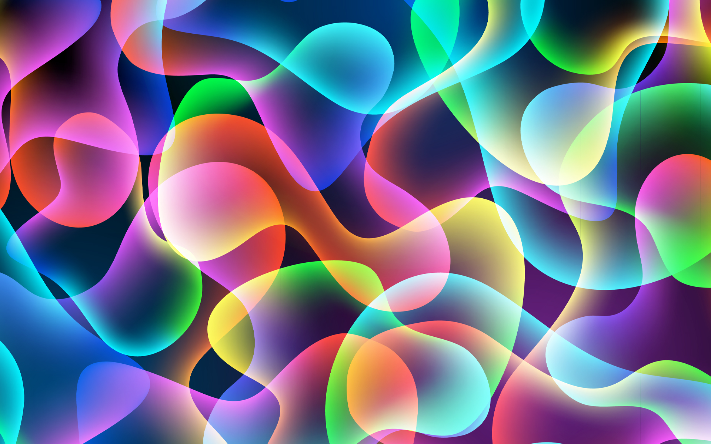
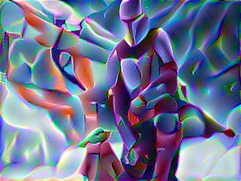
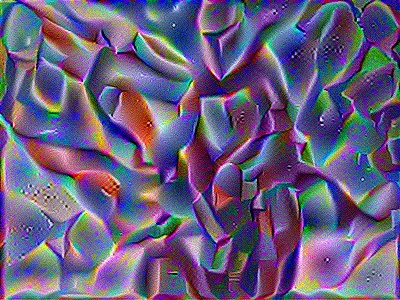
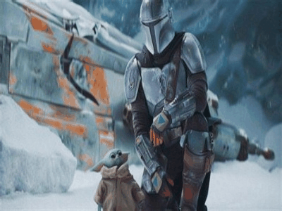

# Art Generation using Deep Learning
This is implementaion on neural style transfer algorithm to add a style to an image.

This implementation in done in tensorflow 1

>### Disclaimer
>Images I have used here may be copyrighted and I am use them only for learning purposes, please don't sue me.

## Examples
#### Content mage percentage is set to 80 and iterations to 201
#### The images used here are already present in images folder

### When done without noise

Content Image | Style Image | output
:------------:|:-----------:|:------:
|  |

### When done with noise
Noise Image | output
:------------:|:------:
 |

### Without Noise evolution

### With Noise

## How to run this 
>- First download the vgg19 model from [here](https://www.kaggle.com/teksab/imagenetvggverydeep19mat) and paste it to `pretrained-model` folder
> - make sure you have all dependencies installed. (`Tensorflow 1`, `opencv`, `scipy.io`, `numpy` )
> - Run either `main.py` or first cell of `main.ipynb`
> - copy your style and content images in images folder, mine are already present if you want to use them.
>- delete the all the images from `output` folder (This is optional, when you will run the code, they will automatically get replaced. This step is only because you dont get confused between my images and yours)
> - You will be asked for name of content and style image. If you are using my images, put `mando.jpg` and `design.jpg`.
> - fill other inputs, then it will start generating images in `output` folder.
> #### Optional
> - If you want to see evolution of images in gif (as I haev shown above), run `imgtogif.py` or second cell of `main.ipynb`. You will need additional dependency for it, that is `imageio`.
> - The gif will get generated in output folder
